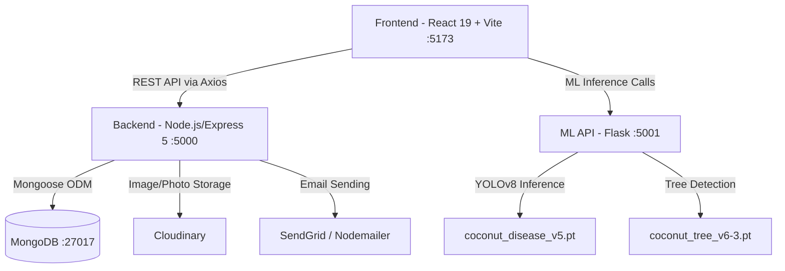

# 🥥 Coco-Guard — Repository Analysis

## Overview

**Coco-Guard** is a full-stack, AI-powered platform for **coconut leaf disease detection** using drone imagery, computer vision, and machine learning. It enables farmers and agronomists to detect diseases in coconut plantations by uploading drone footage or leaf images, then viewing results on an interactive farm map or detailed report.

---

## Architecture at a Glance



---

## Tech Stack

| Layer | Technology |
|---|---|
| **Frontend** | React 19, Vite, Tailwind CSS, React Router 7, Leaflet |
| **Backend** | Node.js, Express 5, MongoDB + Mongoose 8 |
| **ML API** | Python, Flask, Ultralytics YOLOv8, OpenCV, PyTorch |
| **Auth** | JWT (15 min access + 7 day refresh), bcrypt, HTTP-only cookies |
| **Storage** | Cloudinary (images & profile photos) |
| **Email** | SendGrid / Nodemailer |
| **Deployment** | Docker Compose |

---

## Project Structure

```
Coconut_Leaf_Disease_Detection/
├── frontend/          React 19 SPA
├── backend/           Node.js/Express API
├── ml/                Flask ML API + model weights
├── docs/              Documentation, design, proposals
├── deployment/        Deployment configs
├── award_submission/  Award submission materials
├── docker-compose.yml
├── README.md
├── RUN_GUIDE.md
└── REPO_GUIDE.md      Full developer reference
```

---

## Frontend (`frontend/`)

**React 19 + Vite + Tailwind CSS SPA**

### Pages (`src/pages/`)

| Page | Description |
|---|---|
| [Dashboard.jsx](file:///d:/M3%20Projects/Coconut_Leaf_Disease_Detection/frontend/src/pages/Dashboard.jsx) | Stats overview + recent reports |
| [Upload.jsx](file:///d:/M3%20Projects/Coconut_Leaf_Disease_Detection/frontend/src/pages/Upload.jsx) | Batch image & drone video analysis (71KB — most complex page) |
| [AnalyseImages.jsx](file:///d:/M3%20Projects/Coconut_Leaf_Disease_Detection/frontend/src/pages/AnalyseImages.jsx) | Two-stage tree + disease results viewer |
| [FarmMapAnalysis.jsx](file:///d:/M3%20Projects/Coconut_Leaf_Disease_Detection/frontend/src/pages/FarmMapAnalysis.jsx) | Interactive HTML5 canvas orthomosaic viewer (45KB) |
| [MyFarms.jsx](file:///d:/M3%20Projects/Coconut_Leaf_Disease_Detection/frontend/src/pages/MyFarms.jsx) | Farm & plot CRUD (43KB) |
| [Reports.jsx](file:///d:/M3%20Projects/Coconut_Leaf_Disease_Detection/frontend/src/pages/Reports.jsx) | Report list, filter, PDF export |
| [ManageDiseases.jsx](file:///d:/M3%20Projects/Coconut_Leaf_Disease_Detection/frontend/src/pages/ManageDiseases.jsx) | Disease reference library (admin only) |
| [Admin.jsx](file:///d:/M3%20Projects/Coconut_Leaf_Disease_Detection/frontend/src/pages/Admin.jsx) | Profile, security, activity tabs |
| [UserManagement.jsx](file:///d:/M3%20Projects/Coconut_Leaf_Disease_Detection/frontend/src/pages/UserManagement.jsx) | Admin user management |
| [Login.jsx](file:///d:/M3%20Projects/Coconut_Leaf_Disease_Detection/frontend/src/pages/Login.jsx) | Login page |
| [Register.jsx](file:///d:/M3%20Projects/Coconut_Leaf_Disease_Detection/frontend/src/pages/Register.jsx) | Registration (step 1 — send code) |
| [VerifyEmail.jsx](file:///d:/M3%20Projects/Coconut_Leaf_Disease_Detection/frontend/src/pages/VerifyEmail.jsx) | Email verification |
| [ForgotPassword.jsx](file:///d:/M3%20Projects/Coconut_Leaf_Disease_Detection/frontend/src/pages/ForgotPassword.jsx) | Forgot password flow |
| [AboutUs.jsx](file:///d:/M3%20Projects/Coconut_Leaf_Disease_Detection/frontend/src/pages/AboutUs.jsx) | Public about page |

### Components (`src/components/`)

| Component | Description |
|---|---|
| [Sidebar.jsx](file:///d:/M3%20Projects/Coconut_Leaf_Disease_Detection/frontend/src/components/Sidebar.jsx) | Main navigation + user profile + logout |
| [Navbar.jsx](file:///d:/M3%20Projects/Coconut_Leaf_Disease_Detection/frontend/src/components/Navbar.jsx) | Top navigation bar |
| [Profile.jsx](file:///d:/M3%20Projects/Coconut_Leaf_Disease_Detection/frontend/src/components/Profile.jsx) | User profile component (20KB) |
| [ReportPreviewModal.jsx](file:///d:/M3%20Projects/Coconut_Leaf_Disease_Detection/frontend/src/components/ReportPreviewModal.jsx) | Report preview dialog |
| [Security.jsx](file:///d:/M3%20Projects/Coconut_Leaf_Disease_Detection/frontend/src/components/Security.jsx) | Security settings component |
| [Notifications.jsx](file:///d:/M3%20Projects/Coconut_Leaf_Disease_Detection/frontend/src/components/Notifications.jsx) | Notification panel |
| [AuthLayout.jsx](file:///d:/M3%20Projects/Coconut_Leaf_Disease_Detection/frontend/src/components/AuthLayout.jsx) | Auth pages layout wrapper |
| [ProtectedRoute.jsx](file:///d:/M3%20Projects/Coconut_Leaf_Disease_Detection/frontend/src/components/ProtectedRoute.jsx) | Auth guard HOC |
| [Toast.jsx](file:///d:/M3%20Projects/Coconut_Leaf_Disease_Detection/frontend/src/components/Toast.jsx) | Toast notifications |

### Context / State

| File | Description |
|---|---|
| [AuthContext.jsx](file:///d:/M3%20Projects/Coconut_Leaf_Disease_Detection/frontend/src/context/AuthContext.jsx) | Global auth state — user, login, logout, register, verify |
| [ThemeContext.jsx](file:///d:/M3%20Projects/Coconut_Leaf_Disease_Detection/frontend/src/context/ThemeContext.jsx) | Light/dark theme persistence |

### Services (`src/services/`)

| File | Description |
|---|---|
| [api.js](file:///d:/M3%20Projects/Coconut_Leaf_Disease_Detection/frontend/src/services/api.js) | Axios instance with JWT auto-refresh interceptor |
| [authService.js](file:///d:/M3%20Projects/Coconut_Leaf_Disease_Detection/frontend/src/services/authService.js) | Auth API calls |
| [farmMapService.js](file:///d:/M3%20Projects/Coconut_Leaf_Disease_Detection/frontend/src/services/farmMapService.js) | ML API calls for farm map pipeline |
| [farmService.js](file:///d:/M3%20Projects/Coconut_Leaf_Disease_Detection/frontend/src/services/farmService.js) | Farm/plot CRUD API calls |
| [reportService.js](file:///d:/M3%20Projects/Coconut_Leaf_Disease_Detection/frontend/src/services/reportService.js) | Report API calls |
| [userService.js](file:///d:/M3%20Projects/Coconut_Leaf_Disease_Detection/frontend/src/services/userService.js) | User profile API calls |

### Routing

Public routes: `/`, `/login`, `/register`, `/verify-email`, `/forgot-password`, `/reset-password`, `/resend-verification`, `/about`

Protected routes (require JWT): `/dashboard`, `/upload`, `/reports`, `/analyse-images`, `/users`, `/myfarms`, `/admin`, `/diseases`

---

## Backend (`backend/`)

**Node.js + Express 5 API on port 5000**

### Entry Point

[server.js](file:///d:/M3%20Projects/Coconut_Leaf_Disease_Detection/backend/server.js) — Connects to MongoDB, registers routes, sets up CORS, cookie parser, error handler.

### MongoDB Models

| Model | Key Fields |
|---|---|
| [User.js](file:///d:/M3%20Projects/Coconut_Leaf_Disease_Detection/backend/models/User.js) | username, email, password (bcrypt), role (admin/farmer/agronomist/general), status, profileImageUrl, refreshTokens[], emailVerified, verifyCode, resetPasswordCode, twoFactorEnabled |
| [Farm.js](file:///d:/M3%20Projects/Coconut_Leaf_Disease_Detection/backend/models/Farm.js) | Farm entity, owned by a user |
| [Plot.js](file:///d:/M3%20Projects/Coconut_Leaf_Disease_Detection/backend/models/Plot.js) | Sub-unit of a farm, GPS-enabled |
| [Report.js](file:///d:/M3%20Projects/Coconut_Leaf_Disease_Detection/backend/models/Report.js) | reportId, farm, date, issue, severity (value 0-100 + label LOW/MODERATE/HIGH/CRITICAL), status (Pending/Finalized), userId, images[] |
| [Disease.js](file:///d:/M3%20Projects/Coconut_Leaf_Disease_Detection/backend/models/Disease.js) | Disease reference library |
| [DroneFlight.js](file:///d:/M3%20Projects/Coconut_Leaf_Disease_Detection/backend/models/DroneFlight.js) | Drone flight metadata |
| [Image.js](file:///d:/M3%20Projects/Coconut_Leaf_Disease_Detection/backend/models/Image.js) | Image metadata |
| [PendingUser.js](file:///d:/M3%20Projects/Coconut_Leaf_Disease_Detection/backend/models/PendingUser.js) | Temp user store during registration email verification |

### Controllers

| Controller | Responsibility |
|---|---|
| [authController.js](file:///d:/M3%20Projects/Coconut_Leaf_Disease_Detection/backend/controllers/authController.js) | Register, confirm, login, refresh, logout, forgot, verify (16KB) |
| [userController.js](file:///d:/M3%20Projects/Coconut_Leaf_Disease_Detection/backend/controllers/userController.js) | Profile CRUD, profile photo, admin user ops (15KB) |
| [reportController.js](file:///d:/M3%20Projects/Coconut_Leaf_Disease_Detection/backend/controllers/reportController.js) | Report CRUD, PDF download/preview |
| [farmController.js](file:///d:/M3%20Projects/Coconut_Leaf_Disease_Detection/backend/controllers/farmController.js) | Farm CRUD |
| [plotController.js](file:///d:/M3%20Projects/Coconut_Leaf_Disease_Detection/backend/controllers/plotController.js) | Plot CRUD |
| [diseaseController.js](file:///d:/M3%20Projects/Coconut_Leaf_Disease_Detection/backend/controllers/diseaseController.js) | Disease library management |
| [flightController.js](file:///d:/M3%20Projects/Coconut_Leaf_Disease_Detection/backend/controllers/flightController.js) | Drone flight metadata |
| [alertController.js](file:///d:/M3%20Projects/Coconut_Leaf_Disease_Detection/backend/controllers/alertController.js) | Alerts system |

### Routes (`/api/*`)

| Route Prefix | Controller |
|---|---|
| `/api/auth` | authRoutes → authController |
| `/api/users` | userRoutes → userController |
| `/api/farms` | farmRoutes → farmController, plotController |
| `/api/reports` | reportRoutes → reportController |
| `/api/diseases` | diseaseRoutes → diseaseController |
| `/api/flights` | flightRoutes → flightController |
| `/api/alerts` | alertRoutes → alertController |

### Middleware

| File | Purpose |
|---|---|
| [authMiddleware.js](file:///d:/M3%20Projects/Coconut_Leaf_Disease_Detection/backend/middleware/authMiddleware.js) | JWT access token validation |
| [roleMiddleware.js](file:///d:/M3%20Projects/Coconut_Leaf_Disease_Detection/backend/middleware/roleMiddleware.js) | Role-based access control |
| [errorHandler.js](file:///d:/M3%20Projects/Coconut_Leaf_Disease_Detection/backend/middleware/errorHandler.js) | Global error handler |

### Services

| File | Purpose |
|---|---|
| [emailService.js](file:///d:/M3%20Projects/Coconut_Leaf_Disease_Detection/backend/services/emailService.js) | SendGrid / Nodemailer email sending |
| [cloudinary.js](file:///d:/M3%20Projects/Coconut_Leaf_Disease_Detection/backend/services/cloudinary.js) | Cloudinary image upload/delete |
| [pdfService.js](file:///d:/M3%20Projects/Coconut_Leaf_Disease_Detection/backend/services/pdfService.js) | PDF report generation |
| [ml_services.js](file:///d:/M3%20Projects/Coconut_Leaf_Disease_Detection/backend/services/ml_services.js) | ML API proxy service |
| [smsService.js](file:///d:/M3%20Projects/Coconut_Leaf_Disease_Detection/backend/services/smsService.js) | SMS notifications |

---

## ML API (`ml/`)

**Flask server on port 5001 — YOLOv8 inference engine**

### ML Models

| Weight File | Classes | Role |
|---|---|---|
| `coconut_disease_v5.pt` | 4 diseases | Leaf disease — used by `/predict`, `/predict-disease`, `/predict-trees` |
| `coconut_tree_v6-3.pt` | 1 class (coconut_tree) | Tree crown detection — stage 1 of two-stage pipeline |

**Disease classes:** Black Beetle Attack · Magnesium Deficiency · Potassium Deficiency · Yellow Patches

### Key Source Files (`ml/src/`)

| File | Description |
|---|---|
| [app.py](file:///d:/M3%20Projects/Coconut_Leaf_Disease_Detection/ml/src/app.py) | Flask API server, all endpoints (39KB, 1023 lines) |
| [yolo_tree_detector.py](file:///d:/M3%20Projects/Coconut_Leaf_Disease_Detection/ml/src/yolo_tree_detector.py) | coconut_tree_v6-3.pt wrapper |
| [stitch_opencv.py](file:///d:/M3%20Projects/Coconut_Leaf_Disease_Detection/ml/src/stitch_opencv.py) | Video → orthomosaic stitcher (30KB) using cascade matchers: DISK → SuperPoint → ORB → AKAZE → LoFTR → phase correlation |
| [frame_tree_detector.py](file:///d:/M3%20Projects/Coconut_Leaf_Disease_Detection/ml/src/frame_tree_detector.py) | Tile-based YOLO tree detection on large orthomosaics |
| [map_pipeline.py](file:///d:/M3%20Projects/Coconut_Leaf_Disease_Detection/ml/src/map_pipeline.py) | Async farm map job orchestration |
| [segmentation_enhanced.py](file:///d:/M3%20Projects/Coconut_Leaf_Disease_Detection/ml/src/segmentation_enhanced.py) | Watershed tree segmentation (48KB) |
| [gpu_warp.py](file:///d:/M3%20Projects/Coconut_Leaf_Disease_Detection/ml/src/gpu_warp.py) | GPU affine warping via PyTorch |
| [video_service.py](file:///d:/M3%20Projects/Coconut_Leaf_Disease_Detection/ml/src/video_service.py) | Video frame extraction |
| [inference.py](file:///d:/M3%20Projects/Coconut_Leaf_Disease_Detection/ml/src/inference.py) | Generic inference utilities |
| [train.py](file:///d:/M3%20Projects/Coconut_Leaf_Disease_Detection/ml/src/train.py) | Training pipeline |

### ML API Endpoints

| Endpoint | Method | Description |
|---|---|---|
| `/health` | GET | Health check |
| `/predict` | POST | Single-image disease classification |
| `/predict-disease` | POST | Disease with full segmentation masks |
| `/predict-trees` | POST | **Two-stage**: tree detection → per-tree disease |
| `/process-drone-images` | POST | Multi-image stitch → per-tree disease |
| `/process-drone-video` | POST | Video → frames → stitch → per-tree disease |
| `/farm-map/start` | POST | Start async farm map job → returns session_id |
| `/farm-map/progress/<id>` | GET | Poll job progress (0–100%) |
| `/farm-map/result/<id>` | GET | Get orthomosaic + tree list |
| `/farm-map/disease/<id>/<tree_id>` | POST | On-demand per-tree disease |
| `/analyze-video` | POST | Frame-level video analysis |

---

## Key Pipelines

### Two-Stage Disease Detection (`/predict-trees`)

```
Input image
    ├─ Stage 1: coconut_tree_v6-3.pt
    │           → bounding boxes for each tree crown
    └─ Stage 2: for each tree crop + 10% padding
                  coconut_disease_v5.pt
                  → disease + confidence
                  → no detections = Healthy
    Fallback: if 0 trees detected → run disease on full image
```

### Drone Farm Map Pipeline (`/farm-map/start`)

```
Drone video → async job → session_id
  Stage 1 — Stitching: Extract frames → cascade matchers → orthomosaic PNG
  Stage 2 — Tree Detection: Tile orthomosaic → YOLO per tile → NMS → tree list
  Stage 3 — Disease: Per-tree crop → coconut_disease_v5.pt → disease + confidence
  
Frontend polls /farm-map/progress → renders orthomosaic on canvas
User clicks tree → POST /farm-map/disease/{id}/{tree_id} → disease popup
```

---

## Authentication Flow

**Two-step registration:**
1. POST `/api/auth/register` → sends 6-digit verification code to email
2. POST `/api/auth/register/confirm` → verifies code, creates account, issues JWT

**JWT Strategy:**
- Access token: 15-min lifespan, stored as HTTP-only cookie
- Refresh token: 7-day lifespan, stored as HTTP-only cookie
- Auto-refresh in `api.js` Axios interceptor on 401 responses

---

## User Roles

| Role | Permissions |
|---|---|
| `admin` | Full access — all CRUD, user management, disease management |
| `agronomist` | Create & manage reports, read all data |
| `farmer` | Read-only reports, manage own farms |
| `general` | Read-only access |

---

## Service Ports

| Service | Port |
|---|---|
| Frontend (Vite dev) | 5173 |
| Backend (Express) | 5000 |
| ML API (Flask) | 5001 |
| MongoDB | 27017 |
